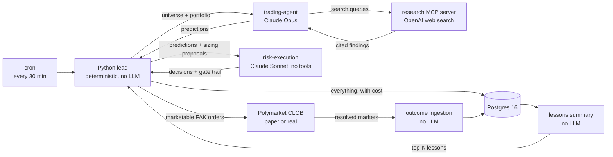
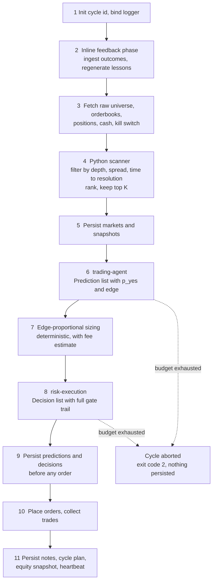
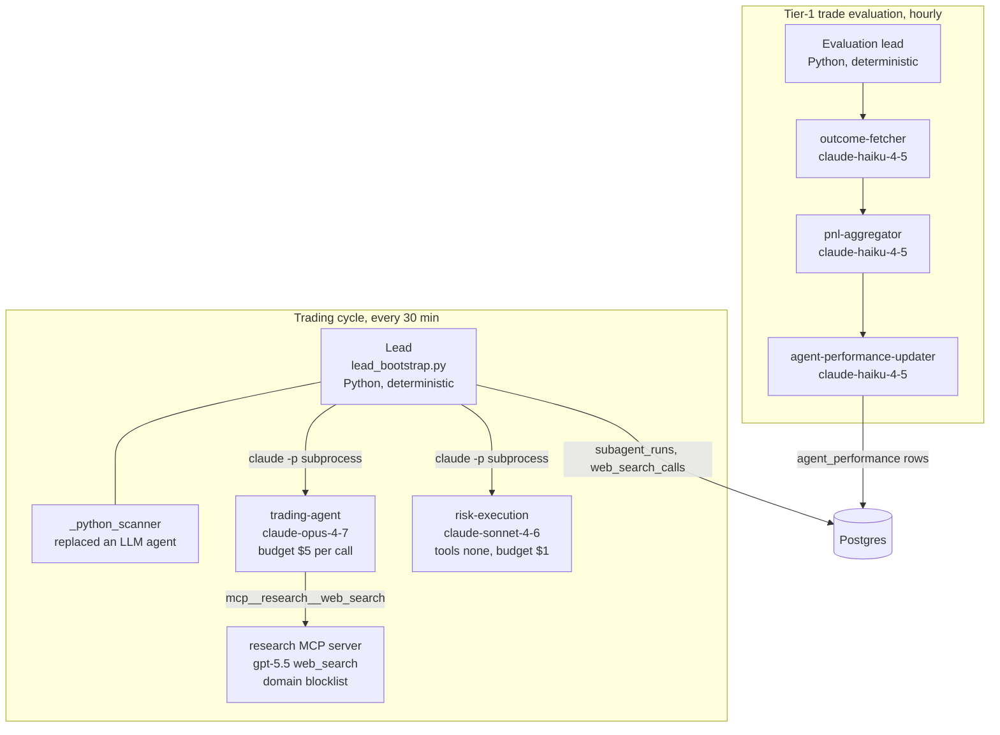
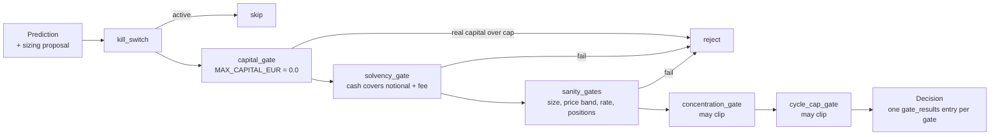
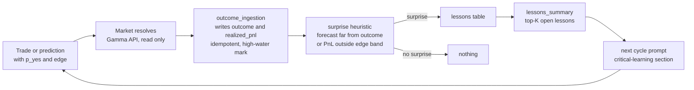
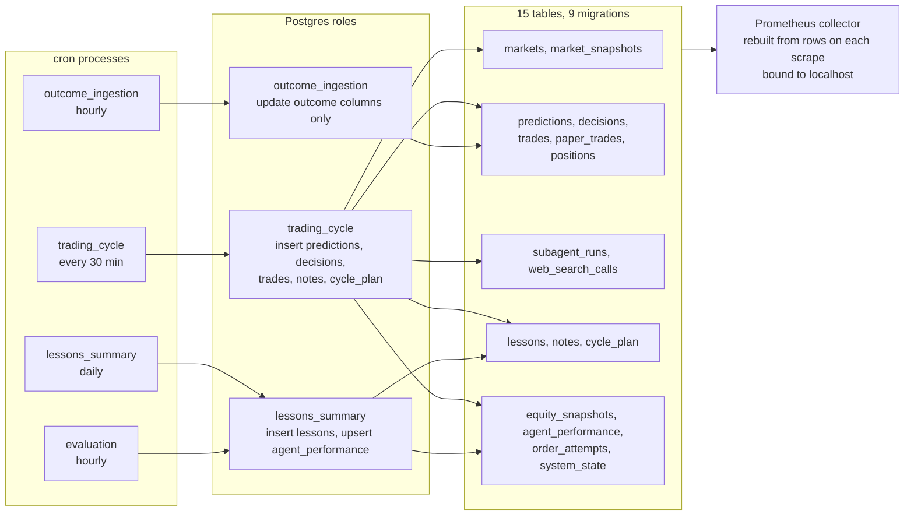

# Autonomous Trading on Polymarket

[](https://github.com/facchini-mika/autonomous-trading/actions/workflows/ci.yml)
[](pyproject.toml)
[](pyproject.toml)
[](pyproject.toml)
[](LICENSE)

An autonomous trading system for the Polymarket prediction market. A deterministic
Python lead runs every thirty minutes, hands a filtered market universe to a Claude
agent that researches and forecasts, hands the forecasts to a second Claude agent
that applies a fixed chain of risk gates, and then places marketable orders itself.
Every LLM call, every web search and every order is persisted with its cost. The
whole thing is built so that a single operator can trust it without watching it.

The project was built spec first, in seven architecture documents, and then
implemented over 83 merged pull requests, each one blocked on ten required CI
checks. The interesting part is not the trading. It is the engineering around
letting language models touch money.

## Why this system is not running in production

Each trading cycle makes two Claude calls and a handful of paid web searches
through OpenAI. Measured on the first two cron-level paper cycles in May 2026,
that looks like this.

| Cycle | Predictions | Anthropic | OpenAI | Total | Wall time |
|---|---|---|---|---|---|
| `cycle-1779278882` (manual smoke) | 3 | $1.05 | $0.98 | $2.03 | 6 min 21 s |
| `cycle-1779281283` (first cron tick) | 4 | $1.04 | $0.80 | $1.84 | 6 min 47 s |

At the twelve-minute cadence used for the first cron run this projects to roughly
$220 to $240 per day. At the current thirty-minute cadence it is roughly $90 per
day. The outcome-ingestion and lessons jobs add almost nothing because they run
without an LLM. These numbers and their cycle IDs are documented in
[`AUDIT_LOG.md`](AUDIT_LOG.md).

That spend only makes sense once the strategy has a measured edge, and measuring
the edge needs weeks of resolved markets. So the system has been run in paper mode
for verification and then switched off. The hard capital cap in
[`src/risk/capital_gate.py`](src/risk/capital_gate.py) is zero, the default trading
mode is `paper`, and no real capital has ever been traded autonomously. The only
real-money action was one manual six-dollar sandbox smoke to prove that EIP-712
signing, token approvals and order submission round-trip against the live
exchange. Polymarket has no testnet, so that was the only way to know.

## The system in one picture



Three things to notice. The lead never calls a model itself. The models never
place orders. And the scanner that picks which markets to look at is plain Python,
because a deterministic filter turned out to be faster, cheaper and easier to test
than the LLM agent it replaced.

## One trading cycle

The entry point is `python -m execution.run_cycle`, called by cron through a
wrapper that sources `.env` and applies a hard timeout. It builds one adapter
(paper or real) and calls `bootstrap_team` in
[`src/execution/lead_bootstrap.py`](src/execution/lead_bootstrap.py), which does the
following in order.



A failed cycle is a non-event. Each cycle is a fresh process, memory in Postgres is
the only coupling between cycles, and cron is the supervisor. If a model call runs
over its dollar budget the cycle aborts before any decision or trade is written,
and the next tick starts clean.

## Agent topology



Claude is reached through the Claude Code CLI as a headless subprocess, one per
agent, with the CLI version pinned in `infra/.claude-code-version`. Each agent is a
Markdown file under [`.claude/agents/`](.claude/agents) with a YAML frontmatter that
declares its model, its allowed tools and its doctrine. The runner appends the
Pydantic JSON schema of the expected output to the system prompt, parses the CLI
envelope, validates the result into a typed model and writes one `subagent_runs`
row with latency, token usage and dollar cost. OpenAI is used for exactly one thing,
web search, behind a local MCP server so that the research tool is swappable and
its calls land in their own cost table.

The scanner decision is worth a paragraph. The first version used a third Claude
agent to filter and rank markets. Measured on a live smoke, replacing it with a
Python filter cut cycle wall time from twelve to fourteen minutes down to 2 min
41 s and cycle cost from $1.31 to $0.60, and it removed the largest source of
timeout tails. The Python scanner still runs the same invariant checks the doctrine
prompt used to demand, so drift between implementation and doctrine is caught in
tests rather than in production.

## Safety engineering

Every prediction passes the same gates in the same order. The order is written in
the risk-execution doctrine and mirrored in tests.



The gates are only the innermost layer. The table lists the others, from the code
outward to the process.

| Layer | What it does | Where |
|---|---|---|
| Hard cap outside settings | `MAX_CAPITAL_EUR` is a `Final` constant in the gate module, not an environment variable. Raising it needs a pull request that trips the audit-log CI job. | `src/risk/capital_gate.py` |
| Paper by default | A clean checkout cannot trade real capital. The crontab generator refuses to emit a crontab when `.env` says `real_capital`. | `src/shared/config/settings.py`, `infra/scripts/gen_local_crontab.sh` |
| 100 percent coverage on risk | The `coverage` workflow fails below 100 percent for `src/risk`. A pre-commit hook rejects any `pragma no cover` in that directory, so the gate cannot be dodged. | `.github/workflows/coverage.yml`, `.pre-commit-config.yaml` |
| Import isolation | `import-linter` forbids `src/risk` from importing adapters, the database, the CLOB client or web3. The gates are pure functions over typed state. | `pyproject.toml` |
| Settings discipline | Every numeric tunable lives in one settings module. Risk keeps frozen copies as literals, and a test asserts they cannot drift. | `tests/risk/test_limits_match_settings.py` |
| Three database roles | The trading cycle, outcome ingestion and lessons summary connect as different Postgres roles with column-level grants. Ground truth can only be written by the job that fetches it. | `infra/sql/00_roles.sh`, `alembic/versions/0003_*` |
| Durable idempotency | Order placement reserves a `cycle_id` plus `decision_id` key in an `order_attempts` table before signing, so a crash mid-cycle cannot double-place. | `src/shared/adapters/db_idempotency_store.py` |
| Marketable FAK only | Orders are fill-and-kill limit orders at the best ask. Nothing rests on the book between cycles. | `src/shared/adapters/polymarket.py` |
| Per-call dollar budgets | Each agent call carries a maximum spend. Exceeding it aborts the cycle before persistence. | `src/execution/subagent_runner.py` |
| Audit log as second reviewer | This is a single-operator project, so GitHub cannot require a second approval. Any PR touching `src/risk/**` or the settings module must add lines to `AUDIT_LOG.md` or CI fails. | `.github/workflows/audit-log-required.yml` |
| Agent-side guard rails | Claude Code hooks intercept any edit under `src/risk/**` and demand approval, block force-pushes and `.env` writes, run gitleaks before a turn ends, and inject a confirmation banner on any prompt that mentions real money. | `.claude/hooks/` |

## The feedback loop



Outcome ingestion and the lessons summary run as plain Python without a model.
Since the inline feedback phase landed, both also run at the start of every trading
cycle, each fail-isolated with its own timeout, so a trade can become an outcome,
a lesson and a changed decision within one cron tick. The standalone cron jobs stay
as an idempotent safety net. On top of that, the hourly Tier-1 evaluation team
computes hit rate, Sharpe and PnL per agent over a rolling window into an
`agent_performance` table. A self-optimising code loop is specified in
[`specs/optimization.md`](specs/optimization.md) but deliberately out of scope for
the MVP. The operator reads lessons and opens pull requests.

## Data, authority boundaries and observability



Every Claude call stores its cost from the CLI envelope. Every web search stores
token counts and a computed price from a pricing table that is deliberately not
overridable by environment. A small CLI aggregates both per cycle, and the numbers
in the cost section above come from it. The Prometheus exporter is a pull-model
collector that rebuilds gauges and counters from database rows, because a cycle
process is too short-lived to host a metrics endpoint itself. It exposes cycle
duration, decision and trade counts, equity, gross exposure, drawdown, kill-switch
state, orphaned order attempts and the per-agent evaluation metrics.

## Engineering practice

| Gate | Job | Required to merge |
|---|---|---|
| Lint | `ruff check` with `select = ["ALL"]`, `ruff format --check` | yes |
| Types | `mypy --strict .` including tests, with the pydantic plugin | yes |
| Secrets | `gitleaks` and `trufflehog` over the diff | yes |
| Tests | 485 tests, property-based tests with Hypothesis for the gates, sizing and the surprise heuristic | yes |
| Coverage | risk 100 percent, execution at least 87 percent, shared and research at least 80 percent | yes |
| Layering | `import-linter` contracts | yes |
| Migrations | upgrade, downgrade to base, upgrade again against a real Postgres service, then role bootstrap | yes |
| End to end | one paper cycle, outcome ingestion and lessons summary against a real Postgres with fake adapters | yes |
| Audit log | PRs touching risk or settings must add audit lines | yes |

A few habits that shaped the codebase.

- **Spec first.** Seven documents under [`specs/`](specs) were written and reviewed
  before the first line of code. Each one marks an explicit MVP versus post-MVP
  boundary, and [`backlog.md`](backlog.md) is a diff of spec against code.
- **Single-operator review.** GitHub forbids approving your own PR, so the ten
  required checks plus the audit-log entry form the review trail. Branch protection
  applies to admins, and no one pushes to `main`.
- **Numbers carry their evidence.** Settings fields are commented with the
  measurement that justified them. For example the raw fetch limit records that on
  one sample day only 27 of 1000 markets fell inside the resolution window.
- **Tests outnumber source.** About 9.6k lines of tests against 8.2k lines of source.
- **Coding agents are part of the toolchain and are constrained like any other
  tool.** [`CLAUDE.md`](CLAUDE.md) holds a no-go list, and the hooks under
  [`.claude/hooks/`](.claude/hooks) enforce it at tool-call time.

## Repository map

| Path | Contents |
|---|---|
| `specs/` | Architecture source of truth, seven documents |
| `src/execution/` | Lead, subagent runner, cycle entry points, outcome ingestion, evaluation, cost report |
| `src/risk/` | The gate modules and sizing, pure functions, protected code |
| `src/research/` | Doctrine prompts, MCP research server, web search, lessons summary, surprise heuristic |
| `src/shared/` | Settings, Pydantic models, adapters (Polymarket, paper, key provider), database, observability |
| `.claude/` | Agent definitions and hooks for Claude Code |
| `alembic/` | Nine migrations |
| `infra/` | Cron fragments, wrapper scripts, wallet and approval scripts, docker-compose, role bootstrap |
| `tests/` | Unit, property-based and end-to-end tests |
| `docs/` | ADRs and operator runbooks |
| `AUDIT_LOG.md` | Append-only safety ledger with 24 entries |
| `plan.md` | The phased build plan that was followed |
| `backlog.md` | Everything in the specs that is not yet in the code, tiered by priority |

## Running it locally

You need Python 3.12, [uv](https://docs.astral.sh/uv/), Docker, a logged-in Claude
Code CLI and an OpenAI API key. Paper mode needs no wallet.

```bash
uv sync
cp .env.example .env            # dev-only Postgres placeholders, add OPENAI_API_KEY
docker compose -f infra/docker-compose.yml up -d
uv run alembic upgrade head
set -a; . ./.env; set +a
uv run python -m execution.run_cycle
```

The cycle logs structured JSON to stdout and writes everything else to Postgres.
`uv run pytest`, `uv run ruff check .` and `uv run mypy --strict .` are the local
equivalents of the CI gates. `infra/scripts/gen_local_crontab.sh` prints a crontab
for the four jobs.

## Status and honest limitations

- Paper mode is verified end to end, including scheduled cron runs.
- `real_capital` has never run autonomously. Three backlog items are named as
  blockers for that, a safety watchdog, drawdown trip-wires and alerting.
- There is no aggregate PnL or hit-rate figure to show. The tables exist, the
  sample does not, because the system was switched off for cost reasons before
  enough markets resolved.
- The model IDs in the agent frontmatter reflect the models available in May 2026.
- The self-improving code loop and the multi-persona ensemble from the specs are
  designed but not built.

## Where to read next

- [`specs/engineering.md`](specs/engineering.md) for the guard rails and the reviewer rule
- [`specs/trading.md`](specs/trading.md) for the team, the timeline of one cycle and the doctrine
- [`specs/trading_feedback.md`](specs/trading_feedback.md) for the evaluation tiers
- [`src/execution/lead_bootstrap.py`](src/execution/lead_bootstrap.py) for the cycle in code
- [`src/research/prompts/`](src/research/prompts) for what the agents are actually told
- [`AUDIT_LOG.md`](AUDIT_LOG.md) for what happened, when, and what could have gone wrong
- [`docs/adr/`](docs/adr) for the key-provider decision

## Disclaimer and license

This is a research and engineering project, not financial advice and not a product.
Prediction markets can lose all of the capital placed in them. If you run this with
real funds you do so at your own risk. Released under the [MIT License](LICENSE).
