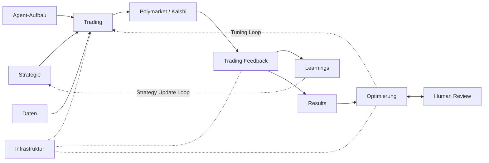

# Polymarket Autonomous Trading System — Index

Single entry point for the system spec. The architecture is split into four component files following the diagram below; this document is the navigation hub.

---

## 1. Architecture

**Two feedback loops, two cadences:**

- **Strategy Update Loop** (semantic, fast — minutes to days). Trade outcomes become `lessons` and `patterns`, get curated, and flow back into Trading via the next cycle's prompt context. **Never changes code.** Owned by `trading_feedback.md §6`.
- **Tuning Loop** (technical, slow — days to weeks). Patterns become Git PRs that the operator reviews and merges. The next Trading cycle after merge picks up the new code. **Always goes through the operator.** Owned by `optimization.md §6`.

---

## 2. The four component files

### [trading.md](./trading.md) — The executing trading instance

The runtime that decides what to trade and places orders. Per-cycle Trading Team, 7-persona agent ensemble, strategy layer, decision logic, per-trade gates as the trading layer sees them, the Strategy Skill Library. Inputs: Strategie + Agent-Aufbau + Daten. Output: trades on Polymarket.

### [infrastructure.md](./infrastructure.md) — Platform, data, execution, ops

Prediction-market interface (Polymarket primary, Kalshi via shared adapter), data ingestion, storage (Postgres / Redis / S3 / TimescaleDB), order execution to the CLOB, position tracking, observability, safety controls, central settings, hooks, secret management. All schemas live here. The other three blocks depend on this one.

### [trading_feedback.md](./trading_feedback.md) — Tier 1 evaluation + Strategy Update Loop

The Trade Evaluation Team (1-min cron, single member: `evaluator`). Computes outcome + PnL + per-agent hit-rate on resolved markets. Emits raw `lessons` when a resolution surprised the ensemble. Owns the system-level evaluation metrics and the paper-mode promotion guidance. **Writes ground-truth data only — never proposes code changes.**

### [optimization.md](./optimization.md) — Tier 2 evaluation + Tuning Loop

The Code Evaluation Team (daily / weekly batches). Two parallel tracks: `strategy-optimizer` (exploit — refine existing) and `strategy-explorer` (explore — try new). `meta-reviewer` arbitrates with an explore/exploit budget rule (§3) plus a 5–7-day anti-whipsaw rule (§4). Opens Git PRs that the operator reviews and merges. **Single objective: maximize the system's net PnL over time.**

---

## 3. Glossary

- **Edge** — signed difference between consensus probability and market-implied probability of the same outcome, net of expected slippage + fees.
- **Resolution risk** — risk that a market resolves contrary to obvious outcome due to ambiguous criteria, oracle dispute, or delay.
- **Paper mode / real-capital mode** — the two operational modes of the system (`infrastructure.md §8.9`). Paper writes orders to a paper-trading ledger; real-capital routes them to the Polymarket CLOB. Switching is a manual settings-file change.
- **Agent orchestration** — coordination of multiple specialized AI agents into an explicit task pipeline, with typed memory artifacts passed between tasks (Tier 1) and reflective memory accumulated across cycles (Tier 2). See `infrastructure.md §1`.
- **Trading Team** — the per-cycle Claude Code Agent Team that decides and places trades (`trading.md`, `infrastructure.md §1`). One fresh team per 12-min cycle.
- **Trade Evaluation Team (Tier 1)** — separate Agent Team scheduled every 1 min; ingests resolved markets and writes ground-truth outcomes + PnL + agent-performance to the long-term tables (`trading_feedback.md §2`). Single member: `evaluator`. Has no live-trading credentials.
- **Code Evaluation Team (Tier 2, formerly "Improvement Team")** — separate Agent Team scheduled in daily/weekly batches; reads Trade-Evaluation outputs and trading memory, proposes code/prompt/strategy/agent-roster changes, opens Git PRs for the operator to review and merge (`optimization.md §2`). Has no live-trading credentials. Never self-merges. Single objective: **maximize the system's net PnL over time** via two parallel tracks — exploit (refine existing) and explore (try new).
- **Exploit (Code-Eval track)** — `strategy-optimizer` agent. Refines what already exists: tunes parameters, rewrites prompts, retires underperforming agents, revises `operating_doctrine`. Lower-risk, narrower-impact proposals. (`optimization.md §2`)
- **Explore (Code-Eval track)** — `strategy-explorer` agent. Proposes things that do not yet exist: new strategies, new trading agents, new market categories. Each proposal must include a paper-mode test plan and an explicit kill-criterion. Higher-risk, wider-impact proposals. (`optimization.md §2`)
- **Explore/exploit budget rule** — `meta-reviewer` enforces a minimum of both tracks in every weekly top-K queue, with the ratio adjusting based on live system performance (drawdown → exploit-heavy; sustained outperformance → explore-heavy). Tunables in central settings (`infrastructure.md §8.21`). (`optimization.md §3`)
- **Anti-whipsaw rule** — a live strategy must run ≥ 5–7 days in `real_capital` before `strategy-explorer` may propose a *replacement*. Refinements via `strategy-optimizer` are not blocked. (`trading.md §3.1`, `optimization.md §4`)
- **Strategy Skill Library** — versioned, named, executable strategy snippets in `research/skills/`. Trading agents invoke skills by name through a `call_skill` tool. (`trading.md §8`, pattern from Voyager)
- **Team Lead Agent** — per-cycle orchestrator. A fresh `claude` process spawned by the scheduler at each cycle: boots the team from the spec, initializes the shared task list, spawns Team Members, routes mailbox traffic, persists artifacts to long-term stores, calls `clean up the team`, and exits. Lifetime = one cycle (~12 min). Never executes orders directly.
- **Team Member Agent** — independent Claude session with its own context window, owns one stage. Communicates with peers via mailbox + shared task list. Pattern from `code.claude.com/docs/en/agent-teams`.
- **Subagent** — focused worker spawned by a Team Member for one-way fan-out. Result returns to the parent only; no peer messaging, no shared task list. Cheaper than a Team Member because results summarize back into the parent context. Pattern from `code.claude.com/docs/en/sub-agents`.
- **Short-term memory** — per-cycle, ephemeral: shared task list + mailbox + in-flight Pydantic artifacts + per-member context windows. Cleared at cycle close. Never read by future cycles.
- **Long-term memory** — across cycles, durable: `notes`, `beliefs`, `predictions`, `decisions`, `trades`, `positions`, `lessons`, `patterns`, `proposals`, `cycle_plan`, `operating_doctrine`, LTKDs. Carries everything future cycles depend on. Schemas: `infrastructure.md §3`.
- **Episodic memory** — per-event durable records (predictions, decisions, trades, positions) used for replay/audit.
- **Reflective memory** — observations + hypotheses written by Code-Evaluation agents into `lessons` after the fact.
- **Belief** — typed structured statement an agent currently holds about how a market or class behaves. In `beliefs` table; performance-tracked (hit rate) when falsifiable; revisions preserve full lineage. Distinct from `predictions` (per-market per-cycle), `notes` (ad-hoc), `lessons` (post-hoc, by Code-Evaluation agents). (`trading.md §2`)
- **Operating doctrine** — single active row of phased operative strategy with target date. Read by trading agents at every cycle boot; revised only by `strategy-optimizer` proposals after operator approval. (`trading.md §2`)
- **Cycle plan** — single-row forward-looking handoff written by the Team Lead at cycle close, read by the next cycle's Lead at boot. Carries priorities, holds-with-rationale, pending settlements, blockers. (`trading.md §2`)
- **Dual knowledge management** — pattern of giving an agent both unstructured `notes` and structured `beliefs` as separate memory stores, each with its own tool API + lifetime. Adopted from Prediction Arena.

---

## 4. Old-section → new-file mapping

For chasing legacy references in commits, issues, or memory:

| Old `specs.md` section | New location |
|---|---|
| §1 Objective | `trading.md §1` |
| §2 System Architecture | `infrastructure.md §1` |
| §3 Trading Loop | `trading.md §5` |
| §4 Agent Design | `trading.md §2` |
| §5 Decision Logic | `trading.md §6` |
| §6 Risk Management | `infrastructure.md §2` (also summarized in `trading.md §7`) |
| §7 Strategy Layer | `trading.md §3` |
| §8 Data Layer | `infrastructure.md §3` |
| §9 Execution Layer | `infrastructure.md §4` (folded into Prediction-Market Interface) |
| §10 Evaluation Metrics | `trading_feedback.md §5` |
| §11 Logging & Observability | `infrastructure.md §5` |
| §12 Safety & Controls | `infrastructure.md §6` |
| §13 Future Extensions | `optimization.md §9` |
| §14.1 Repository Layout | `infrastructure.md §8.1` |
| §14.2 CLAUDE.md | `infrastructure.md §8.2` |
| §14.3 GitHub Integration | `infrastructure.md §8.3` |
| §14.4 Hooks | `infrastructure.md §8.4` |
| §14.5 Subagents | `infrastructure.md §8.5` |
| §14.6 Skills | `infrastructure.md §8.6` |
| §14.7 Risk Layer Protection | `infrastructure.md §8.7` |
| §14.8 Capital Gate | `infrastructure.md §8.8` |
| §14.9 Operational Modes | `infrastructure.md §8.9` |
| §14.10 Paper-mode Promotion | `trading_feedback.md §7` |
| §14.11 Secret Management | `infrastructure.md §8.11` |
| §14.12 Strict Typing & Tests | `infrastructure.md §8.12` |
| §14.13 Custom Slash Commands | `infrastructure.md §8.13` |
| §14.14 Permission Modes | `infrastructure.md §8.14` |
| §14.15 Workflow Discipline | `infrastructure.md §8.15` |
| §14.16 Parallel Work Setups | `infrastructure.md §8.16` |
| §14.17 Audit Trail | `infrastructure.md §8.17` |
| §14.18 MCP Servers | `infrastructure.md §8.18` |
| §14.19 Development-Side Observability | `infrastructure.md §8.19` |
| §14.20 Open-Source First Reuse | `optimization.md §8` |
| §14.21 Centralized Configuration | `infrastructure.md §8.21` |
| §14.22 Agent Teams Production Runtime | `infrastructure.md §8.22` |
| §15 intro (two-tier framing) | `trading_feedback.md §1` + `optimization.md §1` |
| §15.0 Trade Evaluation Team | `trading_feedback.md §2` |
| §15.1 Code Evaluation Team Roster | `optimization.md §2` |
| §15.1.1 Explore vs Exploit Budget | `optimization.md §3` |
| §15.2 Shared Memory & Notes | `infrastructure.md §3` (schemas) + `optimization.md §2` (writers) |
| §15.3 Learning Loop Cadence | `optimization.md §5` |
| §15.4 Checks and Balances | `optimization.md §7` |
| §15.5 Capital-Allocation Feedback | `infrastructure.md §7` |
| §15.6 Safety Boundary | `infrastructure.md §6` |
| §15.7 Failure Modes | split: Tier 1 → `trading_feedback.md §8`; Tier 2 → `optimization.md §10` |
| Appendix A Tech Stack | `infrastructure.md` Appendix A |
| Appendix B Glossary | `index.md §3` (this file) |

**Anchored additions (new content not in old `specs.md`):**

| Section | What's new |
|---|---|
| `infrastructure.md §4` | **Prediction-Market Interface** — explicit `PredictionMarketAdapter` Protocol with `PolymarketAdapter` (primary), `KalshiAdapter` (read-only), `PaperTradingAdapter` (mode-selected). Folds in old §9 Execution as the Polymarket implementation. |
| `trading.md §3.1` + `optimization.md §4` | **Anti-whipsaw rule** — live strategies must run ≥ 5–7 days in real_capital before replacement. |
| `trading.md §8` | **Strategy Skill Library** — versioned, named, executable strategy snippets in `research/skills/`. Pattern from Voyager. |
| `optimization.md §3.1` | **MAB formalism note** — citations for Discounted UCB, SW-UCB, f-dsw TS as the formal analogue of the explicit budget rule. We keep the explicit rule for now. |
| `optimization.md §8` | **TradingAgents prior-art citation** for the 7-role ensemble + **Self-Improving Coding Agent prior-art citation** for the autonomous-PR pattern + **Reflexion / MAR prior-art citation** for the lessons mechanism. |

---

## 5. How to navigate

**To understand a per-cycle decision:** read `trading.md`. Cross-refs to `infrastructure.md §3` for schemas, `infrastructure.md §2` for risk gates.

**To understand the data flow / storage / ops:** read `infrastructure.md`. The big section is §3 (Data Layer with all schemas) and §4 (Prediction-Market Interface).

**To understand what happens when a market resolves:** read `trading_feedback.md`. The Strategy Update Loop description is §6.

**To understand the merge gate for any code change:** read `optimization.md §7` (review counts). The full PR workflow is `optimization.md §2` "Implementation flow for a code change."

**To find a value (limit, threshold, timeout, ratio):** central settings file `shared/config/settings.toml`, defined in `infrastructure.md §8.21`.

**To trace a legacy `§X.Y` reference:** §4 mapping table above.

---

## See also

- `specs.md` — thin redirect file kept for backward compatibility with all prior references (CLAUDE.md, hooks, memory, git commit messages). Contains a 1-paragraph context note and links to this file plus the four component files.
- The four files: [trading.md](./trading.md) · [infrastructure.md](./infrastructure.md) · [trading_feedback.md](./trading_feedback.md) · [optimization.md](./optimization.md).
