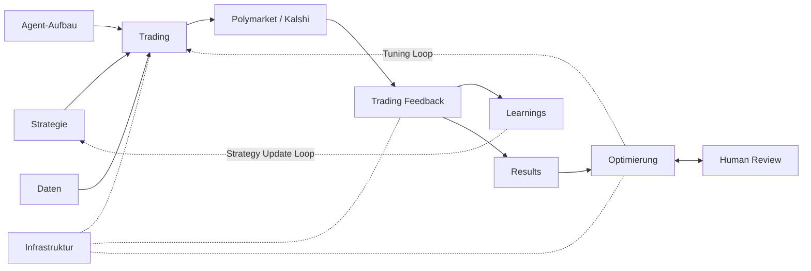

# Polymarket Autonomous Trading System

The system is split into four component files matching the four-block architecture below. This file is the entry point.

## Architecture

Two feedback loops, two cadences:
- **Strategy Update Loop** (semantic, minutes–days): outcomes → `lessons` / `patterns` → next-cycle prompt context. Never changes code. Owned by `trading_feedback.md §6`.
- **Tuning Loop** (technical, days–weeks): patterns → Git PRs → operator review → merge → next cycle uses new code. Owned by `optimization.md §6`.

## Files

| File | Owns |
|---|---|
| [trading.md](./trading.md) | Per-cycle Trading Team, 7-persona ensemble, strategy layer, decision logic, per-trade gates, Strategy Skill Library |
| [infrastructure.md](./infrastructure.md) | Prediction-market interface (Polymarket/Kalshi adapter), data layer + all schemas, execution, observability, safety controls, central settings, hooks |
| [trading_feedback.md](./trading_feedback.md) | Tier 1 — Trade Evaluation Team (1-min cron), result computation, learning generation, evaluation metrics, paper-mode promotion |
| [optimization.md](./optimization.md) | Tier 2 — Code Evaluation Team (daily/weekly), exploit + explore tracks, anti-whipsaw rule, review counts, prior-art reuse |
