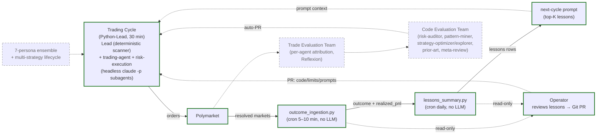

# Polymarket Autonomous Trading System

## Goal

Autonomes Trading auf Polymarket mit AI-Agenten. **Beide Modi ab Tag 1**: `paper` (Default) und `real_capital` (EIP-712-signiert via KMS oder encrypted-at-rest). Konstitutionelles Hard-Cap `MAX_CAPITAL_EUR` (zwei-Reviewer-Approval bei Änderung). Self-Improvement im MVP **manuell** (Operator liest Lessons → Git-PR); volle Multi-Agent-Auto-Optimierung ist Post-MVP.

## Architecture

**Legende:** Solide grüne Boxen = **MVP** (gebaut). Gestrichelte graue Boxen = **Post-MVP / Outlook** (in den jeweiligen `Weiterer Ausbau`-Sections der Sub-Files spezifiziert).

## Feedback Loops

- **Strategy Update Loop** (MVP, automatisch, deterministisch): `outcome_ingestion.py` schreibt Ground-Truth → `lessons_summary.py` (daily) emittiert `lessons` via Surprise-Heuristik → next-cycle Trading-Prompt liest top-K offene Lessons. **Kein LLM** in diesem Loop. Owned by `trading_feedback.md §1` + `optimization.md §1`.
- **Tuning Loop** (MVP **manuell**): Operator reviewt Lessons in Postgres, entscheidet ob Code/Prompts/Limits geändert werden, öffnet Git-PR. Branch-Protection (`engineering.md §8`) ist die Merge-Gate. Automatisierter Code-Evaluation-Team-Pfad ist Post-MVP, owned by `optimization.md §5`.

## Cadences (MVP)

| Job | Cadence | Type |
|---|---|---|
| Trading Cycle | 30 min | Python-Lead + 2 LLM subagents (headless `claude -p`) |
| Outcome Ingestion | 5–10 min | Python script, no LLM |
| Lessons Summary | daily | Python script, no LLM |

Alle drei Jobs laufen via Cron, jeder als frischer Prozess. Authority-Boundary über drei dedizierte Postgres-Rollen (`trading_cycle`, `outcome_ingestion`, `lessons_summary`) — siehe `orchestration.md`.

## Modes & Constitution

- `TRADING_MODE = "paper" | "real_capital"` (zentral in `engineering.md §10`).
- Default = `paper`. Flip `paper → real_capital` per PR mit ≥2 Reviewern; `real_capital → paper` mit ≥1 Reviewer (`engineering.md §4`).
- Konstitutionelles Hard-Cap `MAX_CAPITAL_EUR`: jede Änderung erfordert zwei menschliche Approver. Runtime-Backstop in `src/risk/capital_gate.py`.
- Manueller Kill-Switch: Row in `system_state(key='kill_switch')` blockt neue Orders sofort.

## Files

| File | Owns (MVP) |
|---|---|
| [trading.md](./trading.md) | Per-cycle Trading topology (Python-Lead + 2 LLM subagents), Mispricing-Strategie (3% edge), Edge-Berechnung, 3 per-Trade-Gates, Order-Placement (paper / EIP-712). Outlook: `§8`. |
| [orchestration.md](./orchestration.md) | 1 cycle process (Python-Lead) + 2 Python-Skripte + 3 Postgres-Rollen, Cycle-Bootstrap, Memory-Split (in-process vs. Postgres), Hooks-Wiring. |
| [data_infrastructure.md](./data_infrastructure.md) | Postgres-16-Schemas, `PolymarketAdapter` (read + write + EIP-712), `PaperTradingAdapter`, Prometheus / Grafana / OTel. |
| [engineering.md](./engineering.md) | Risk-Layer als protected code (100% Coverage, `import-linter`), Kill-Switch, EIP-712-Key-Handling (KMS / encrypted-at-rest), zentrale Settings, Hooks (Dev + Prod), Tech-Stack. Outlook: `§13`. |
| [trading_feedback.md](./trading_feedback.md) | `outcome_ingestion.py`: idempotent Ground-Truth-Writer auf `predictions.outcome` / `realized_pnl`, read-only Gamma. Outlook: `§6` (Trade-Evaluation-Team). |
| [optimization.md](./optimization.md) | `lessons_summary.py`: Surprise-Heuristik, INSERT only auf `lessons`. Outlook: `§5` (Code-Evaluation-Team mit explore/exploit, Anti-Whipsaw). |
